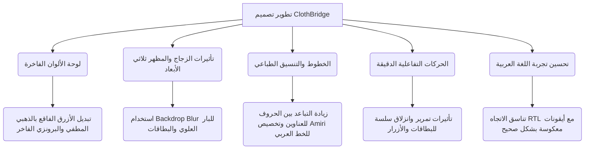

# 🎨 دليل تحسين وتطوير تصميم موقع ClothBridge
> **ClothBridge: Luxury Fashion Redefined & Smart Donation Platform**

مرحباً بك! موقع **ClothBridge** مبني بفكرة رائعة تجمع بين **فخامة الأزياء (Luxury Fashion)** و**عمل الخير والتبرع (Donation)**. الهيكل الحالي للموقع جيد جداً ويستخدم تقنيات حديثة مثل Tailwind CSS ومكتبة Lucide للأيقونات.

ولكن، لكي ينتقل الموقع من تصميم "مقبول" أو "عادي" إلى **تصميم فاخر (Premium / High-End Design)** يجذب العين ويبهر المستخدم من النظرة الأولى (Wow Factor)، أعددت لك هذا الدليل الشامل الذي يحتوي على نصائح عملية، أكواد CSS جاهزة، وأفكار تفاعلية مبتكرة.

---

## 🌟 ملخص المقترحات الفنية (At a Glance)


---

## 1. لوحة الألوان الفاخرة (Premium Luxury Color Palette)
### ⚠️ الوضع الحالي:
تستخدم حالياً اللون الأزرق الفاقع `rgb(51, 153, 255)` كلون مميز أساسي (`--accent`). هذا اللون ممتاز للمواقع التقنية (SaaS) أو لوحات التحكم، ولكنه **يفقد الموقع طابع الفخامة والرقي** الخاص ببيوت الأزياء العالمية (مثل Chanel أو Gucci أو Dior).

### 💡 التطوير المقترح:
1. **اللون الذهبي الملكي المطفي (Royal Muted Gold):** نغير اللون المميز إلى درجات الذهبي الدافئ أو البرونزي، فهو يرمز فوراً للفخامة والجمال ويتباين بشكل ساحر مع الخلفية الداكنة.
2. **الخلفيات الداكنة العميقة (Rich Deep Obsidian):** نستخدم درجات أسود ناعمة مع لمحة رمادية دافئة بدلاً من الأسود الحاد.

#### 🛠️ كود CSS المقترح لتعديله في `productes.css`:
```css
:root {
  --bg: #0d0d0d;              /* أسود ملكي عميق جداً */
  --card: #161616;            /* رمادي داكن دافئ للبطاقات */
  --accent: #d4af37;          /* ذهبي كلاسيكي فاخر (Metallic Gold) */
  --accent-hover: #f3e5ab;    /* ذهبي فاتح وناعم للتأثيرات */
  --text: #f9f9f9;            /* أبيض عاجي مريح للعين */
  --font: 'Outfit', sans-serif;
}

/* في الوضع المضيء (Light Mode) */
.light-mode {
  --bg: #faf9f6;              /* أبيض عاجي دافئ (Alabaster) بدلاً من الأبيض الناصع */
  --card: #ffffff;
  --text: #1a1a1a;            /* أسود فحمي ناعم */
  --accent: #b8860b;          /* ذهبي داكن ليناسب الخلفيات الفاتحة */
  --accent-hover: #d4af37;
}
```

---

## 2. تأثيرات الزجاج والمظهر ثلاثي الأبعاد (Glassmorphism & Depth)
تصاميم الويب الفاخرة تعتمد على الإحساس بالعمق والطبقات. البار العلوي (Navbar) والبطاقات والـ Modals ستبدو مذهلة إذا كانت شبه شفافة مع تأثير الضباب.

### 💡 التطوير المقترح:
1. **شريط التنقل الزجاجي (Glassmorphic Navbar):** جعل البار العلوي يندمج مع الخلفية أثناء التمرير.
2. **حدود البطاقات المتوهجة (Subtle Glowing Borders):** إضافة حدود رفيعة جداً وشبه شفافة تتوهج بنعومة عند مرور الماوس.

#### 🛠️ تعديل الـ CSS لـ Navbar والبطاقات:
```css
/* شريط التنقل */
nav.sticky {
  background: rgba(22, 22, 22, 0.7) !important;
  backdrop-filter: blur(12px) -webkit-backdrop-filter: blur(12px);
  border-bottom: 1px solid rgba(255, 255, 255, 0.05) !important;
  transition: all 0.3s ease;
}

.light-mode nav.sticky {
  background: rgba(255, 255, 255, 0.8) !important;
  border-bottom: 1px solid rgba(0, 0, 0, 0.05) !important;
}

/* بطاقات المنتجات المذهلة */
.product-card {
  background: var(--card);
  border: 1px solid rgba(255, 255, 255, 0.03);
  border-radius: 16px; /* زوايا أنعم */
  overflow: hidden;
  position: relative;
  transition: all 0.4s cubic-bezier(0.16, 1, 0.3, 1); /* حركة ناعمة فيزيائية */
}

.product-card:hover {
  transform: translateY(-8px);
  border-color: rgba(212, 175, 55, 0.3); /* توهج ذهبي خفيف عند الهوفر */
  box-shadow: 0 20px 40px rgba(0, 0, 0, 0.6), 
              0 0 30px rgba(212, 175, 55, 0.05);
}
```

---

## 3. الخطوط والتنسيق الطباعي الفاخر (Elegant Typography)
لقد أحسنت اختيار الخطوط! خط `Cormorant Garamond` (السيريف الكلاسيكي) للعناوين و `Outfit` للنصوص العادية هو مزيج ممتاز يجمع بين العراقة والحداثة. لكن يمكننا تحسين طريقة عرضها.

### 💡 التطوير المقترح:
1. **تباعد الحروف (Letter Spacing / Tracking):** العناوين الفرعية المكتوبة بالأحرف الكبيرة (Uppercase) تبدو أكثر فخامة وإثارة إذا زدنا التباعد بين حروفها بشكل ملحوظ.
2. **تخصيص الخطوط للغة العربية (Arabic Typography):** 
   حينما يتحول الموقع للغة العربية، فإن المتصفح يستخدم الخط الافتراضي للجهاز وهو غالباً ما يكون خطاً تقليدياً يفسد جمال التصميم. يجب دمج خط عربي فاخر ومتناسق مثل خط **Tajawal** أو **Cairo** للعناوين العادية، وخط **Amiri** للعناوين الكبيرة الفاخرة ليطابق طابع `Cormorant Garamond`.

#### 🛠️ دمج خطوط عربية فاخرة في الـ `<head>` وتنسيق الـ CSS:
أضف هذا الرابط في الـ `<head>` في جميع ملفات الـ HTML:
```html
<link href="https://fonts.googleapis.com/css2?family=Amiri:ital,wght@0,400;0,700;1,400&family=Tajawal:wght@300;400;500;700&display=swap" rel="stylesheet">
```

ثم أضف في الـ CSS الخاص باتجاه الـ RTL:
```css
/* العناوين والتنسيقات للغة العربية */
[dir="rtl"] {
  font-family: 'Tajawal', sans-serif !important;
}

[dir="rtl"] .font-display {
  font-family: 'Amiri', serif !important;
  font-weight: 400;
  letter-spacing: 0 !important; /* تباعد الحروف لا يناسب العربية */
}

/* تباعد الحروف للعناوين الإنجليزية لتبدو كالمجلات الراقية */
.tracking-\[6px\] {
  letter-spacing: 0.25em !important;
}
```

---

## 4. الحركات التفاعلية الدقيقة (Micro-interactions & Hover Effects)
الموقع الفاخر يُشعر المستخدم بنبض الحياة والحركة مع كل حركة ماوس.

### 💡 التطوير المقترح:
1. **أزرار بتأثير لمعان معدني (Shimmer Gold Buttons):** زر "تسوق الآن" أو "تبرع" يجب أن يحتوي على لمعان داخلي يتحرك عند مرور الماوس.
2. **تأثير كشف تفاصيل المنتج (Reveal Overlay):** عند وضع الماوس على صورة المنتج، تظهر أيقونات سريعة كالتبرع أو الإضافة للسلة بشكل انسيابي لطيف مع تعتيم أنيق للصورة.

#### 🛠️ كود CSS للأزرار المتطورة:
```css
.gold-btn {
  background: linear-gradient(135deg, #d4af37, #aa7c11);
  color: #000000 !important; /* النص أسود لتباين حاد ممتاز */
  font-weight: 600;
  border-radius: 8px;
  position: relative;
  overflow: hidden;
  transition: all 0.4s cubic-bezier(0.16, 1, 0.3, 1);
  box-shadow: 0 4px 15px rgba(212, 175, 55, 0.2);
}

.gold-btn::after {
  content: '';
  position: absolute;
  top: 0; left: -100%;
  width: 50%; height: 100%;
  background: linear-gradient(90deg, transparent, rgba(255, 255, 255, 0.4), transparent);
  transition: all 0.6s ease;
}

.gold-btn:hover {
  transform: translateY(-3px);
  box-shadow: 0 10px 25px rgba(212, 175, 55, 0.4);
}

.gold-btn:hover::after {
  left: 200%;
}

/* الأزرار المفرغة */
.outline-btn {
  border: 1px solid rgba(212, 175, 55, 0.6);
  color: var(--accent);
  border-radius: 8px;
  transition: all 0.3s ease;
}

.outline-btn:hover {
  background: rgba(212, 175, 55, 0.08);
  border-color: var(--accent);
  color: var(--accent-hover);
}
```

---

## 5. تحسين قسم الـ Hero وصورة الواجهة (Visual Assets & Overlay)
صورة الخلفية الحالية في ملف `index.html` تشير إلى اسم ملف محلي باللغة العربية (`_3 أبريل 2026 عند الساعة 7_09 م.jpg`). 

### 💡 التطوير المقترح:
1. **تسمية الأصول الرقمية:** يفضل دائماً إعطاء الصور أسماء باللغة الإنجليزية بدون مسافات (مثال: `hero-fashion-bg.jpg`) لضمان عدم حدوث مشاكل في خوادم الويب عند رفع الموقع.
2. **استخدام طبقة تعتيم متدرجة ذكية (Dynamic Gradients):** في بعض الأحيان قد تكون الصورة ساطعة مما يجعل قراءة النصوص البيضاء صعبة. سنقوم بتحسين كلاس `.theme-overlay` ليعطي تدرجاً ناعماً جداً يركز الضوء في المنتصف ويعتم الأطراف لجمالية دراماتيكية مسرحية (Vignette Effect).

#### 🛠️ كود تحسين طبقة الـ Hero:
```css
.theme-overlay {
  background: radial-gradient(circle, rgba(0, 0, 0, 0.4) 0%, rgba(0, 0, 0, 0.85) 100%) !important;
  z-index: 1;
}

.light-mode .theme-overlay {
  background: radial-gradient(circle, rgba(255, 255, 255, 0.2) 0%, rgba(255, 255, 255, 0.75) 100%) !important;
}
```

---

## 6. تعديلات سريعة تجعل تصميمك مكتملاً وأكثر احترافية
* **تصميم بطاقات الميزات (Features Cards):** في قسم المميزات (السطور 39-72 في `index.html`)، الخلفية الدائرية للأيقونات تحتوي على تدرج لوني أزرق `from-[rgb(51, 153, 255)] to-[rgb(0, 102, 204)]`. نقترح تحويلها لتدرج ذهبي مطفي دافئ أو حتى جعلها مفرغة بخطوط ذهبية رفيعة لتبدو راقية بدلاً من الألوان الصارخة.
* **الأزرار العائمة (Scroll-to-Top):** إضافة زر عائم صغير وجميل في أسفل الصفحة للتمرير السلس للأعلى، مصمم باللون الذهبي والزجاجي.
* **البطاقات المنحنية برفق:** كروت المنتجات وقسم الـ CTA يفضل أن تستخدم انحناء `rounded-2xl` أو `rounded-3xl` يعطي إحساساً عصرياً.

---

## 🚀 خطة العمل المقترحة (Next Steps)
إذا كنت ترغب في تطبيق هذه التعديلات الرائعة فوراً، يمكنني مساعدتك في:
1. **تحديث ملف `productes.css`** بلمسة واحدة لنضيف كل التدرجات الذهبية الملكية، كلاسات الزجاج، والتأثيرات التفاعلية الجديدة.
2. **تحديث ملف `layout.js`** لتعديل الخطوط للغة العربية (إضافة `Tajawal` و `Amiri`) وتغيير الهيدر والفوتر ليتناسبوا مع نظام الألوان الجديد.
3. **تطبيق كلاسات التحسين البصري على `index.html`** والموديلات الخاصة بالتبرع والسلة لجعلها متطابقة مع هذا التصميم المبهر.

> **ما رأيك في هذه الأفكار؟ هل نبدأ بتحديث لوحة الألوان وتحويل الأزرار وتأثيرات الهوفر إلى نظام الذهب الفاخر الموصوف أعلاه؟** 🌟
